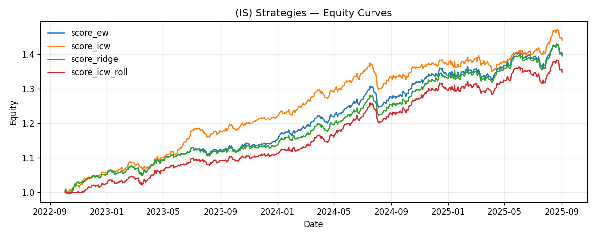

I reviewed your README draft — it’s already solid 👌. Below is a **harmonized version** with consistent formatting, clearer sectioning, and removal of small incoherences (like mixed headings and dangling `##`).

````markdown
# EU Equities — Factor Research & Simple Long-Only Backtests

Small, reproducible factor-research sandbox for EU equities (STOXX-like universe).  
It fetches data, engineers factors, and runs a few simple long-only scoring strategies.

---

## Quick start

```bash
# 1) Fetch market & index data
python 1_FETCH_DATA.py

# 2) Build factors (writes DATA_ENG outputs)
python 2_DATA_ENG.py

# 3) Run alpha research & backtests (writes ALPHA outputs)
python 3_ALPHA_RESEARCH.py
````

---

## Results (monthly rebalance, top-quintile long-only)

| strategy         | ann\_ret | ann\_vol | sharpe | max\_dd |
| ---------------- | -------: | -------: | -----: | ------: |
| score\_ew        | 0.124233 | 0.053421 |  2.436 | -0.0467 |
| score\_icw       | 0.136044 | 0.052957 |  2.436 | -0.0559 |
| score\_ridge     | 0.123583 | 0.053505 |  2.205 | -0.0451 |
| score\_icw\_roll | 0.113112 | 0.052621 |  2.063 | -0.0469 |

**Chart** — example equity curve comparison:



---

## Factors used

```
adv_eur_20
amihud_20d
beta_252
beta_60
country_rel_mom_6_1
hi52_prox
liq_proxy
max5_21d
mom_12_1
mom_6_1
ret_stock
rev_5d
sector_rel_mom_6_1
size_proxy
vol_252d
vol_60d
zero_ret_20d
```

> Some candidates may be discarded at build-time for coverage/quality.
> Document the discarded list if needed.

---

## Data quality & diagnostics

* **Factor completeness:** `factor_completeness.csv`
  (columns: `factor, non_null, total_rows, pct_non_null, avg_names_per_date, first_date, last_date`)
* **Factor correlations (latest EoM, z-scored):** `factor_correlations.csv`

---

## Repo layout (minimal)

* `1_FETCH_DATA.py` — fetch prices & country indices (e.g., Yahoo), writes raw inputs.
* `2_DATA_ENG.py` — engineer factor panel & diagnostics under `DATA_ENG/`.
* `3_ALPHA_RESEARCH.py` — z-scores, neutralization, scoring, and backtests under `ALPHA_OUTPUTS/`.

---

## Notes

* **Rebalance**: monthly (EoM), long-only top 20% by score, equal weight.
* **Returns**: daily; excess vs. country index when available; 1-day embargo.
* **Costs/slippage**: configurable in `3_ALPHA_RESEARCH.py`.

---

## Command-line arguments (3\_ALPHA\_RESEARCH.py)

| Argument                | Type     | Default                                           | Choices               | Description                                                   |
| ----------------------- | -------- | ------------------------------------------------- | --------------------- | ------------------------------------------------------------- |
| `--indir`               | Path     | `DEFAULT_INDIR`                                   | –                     | Input directory with DATA\_ENG exports                        |
| `--outdir`              | Path     | `DEFAULT_OUTDIR`                                  | –                     | Output directory for alpha artifacts                          |
| `--horizons`            | int list | `[1, 5, 21, 40]`                                  | –                     | Forward return horizons (days)                                |
| `--ic_method`           | str      | `"spearman"`                                      | `pearson`, `spearman` | Information Coefficient (IC) method                           |
| `--neutralize`          | list     | `[country, supersector, size_bucket, liq_bucket]` | –                     | Neutralization buckets (empty list disables)                  |
| `--robust_z`            | flag     | `False`                                           | –                     | Use robust median/MAD z-scores                                |
| `--rebalance`           | str      | `"M"`                                             | `M`, `W`, `D`         | Rebalance frequency (month, week, day)                        |
| `--topq`                | float    | `0.2`                                             | –                     | Top-quantile for long-only tilts (e.g., 0.2 = top 20%)        |
| `--tc_bps`              | float    | `5.0`                                             | –                     | Transaction cost per 100% turnover, in bps                    |
| `--ic_roll_m`           | int      | `18`                                              | –                     | Rolling months for IC-weight lookback                         |
| `--ic_shrink`           | float    | `0.6`                                             | 0–1                   | Shrink weights toward equal-weight                            |
| `--ic_max_abs_w`        | float    | `0.40`                                            | –                     | Max absolute weight per factor after normalization & clipping |
| `--ic_min_months`       | int      | `10`                                              | –                     | Minimum sample months required to compute IC-weight           |
| `--cv_enable`           | flag     | `False`                                           | –                     | Enable time-based cross-validation (OOS)                      |
| `--cv_train_months`     | int      | `36`                                              | –                     | Training window size (months)                                 |
| `--cv_test_months`      | int      | `6`                                               | –                     | Testing window size (months)                                  |
| `--cv_gap_months`       | int      | `1`                                               | –                     | Gap between train and test windows (months)                   |
| `--cv_min_train_months` | int      | `24`                                              | –                     | Minimum months required in training to form a CV fold         |

---

## Example runs

### Run with defaults

```bash
python 3_ALPHA_RESEARCH.py
```

### Custom run

```bash
python 3_ALPHA_RESEARCH.py \
    --indir 1_0_DATA_ENG \
    --outdir 2_0_ALPHA_OUTPUTS \
    --rebalance M \
    --topq 0.1 \
    --tc_bps 10 \
    --cv_enable \
    --cv_train_months 36 \
    --cv_test_months 6 \
    --cv_gap_months 1
```

`````

---


`````
