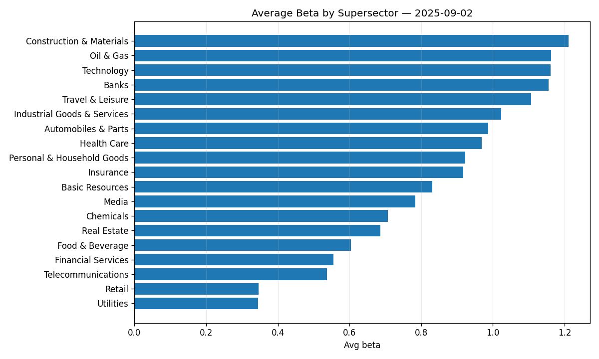
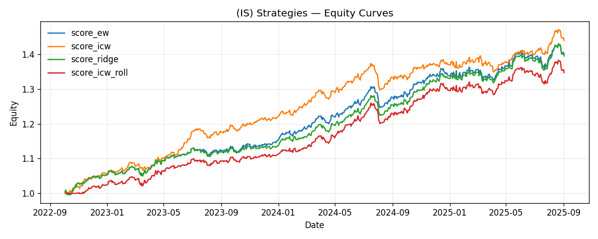

# European Equity Factor Research

A Python research pipeline for constructing equity factors, studying cross-sectional information coefficients, and comparing simple long-only portfolio scores.

**Start with:** [factor engineering](2_DATA_ENG.py) · [alpha research](4_ALPHA_RESEARCH.py) · [saved diagnostic charts](3_0_ALPHA_OUTPUTS).

## Research workflow

| Stage | Entry point | Purpose |
| --- | --- | --- |
| Data collection | [1_FETCH_DATA.py](1_FETCH_DATA.py) | Download adjusted stock and country-index prices using yfinance. |
| Factor engineering | [2_DATA_ENG.py](2_DATA_ENG.py) | Build momentum, reversal, volatility, liquidity, and beta features; export panels and coverage diagnostics. |
| Exploration | [3_EDA.py](3_EDA.py) | Explore the factor data and universe. |
| Alpha research | [4_ALPHA_RESEARCH.py](4_ALPHA_RESEARCH.py) | Neutralize and standardize signals, estimate ICs, construct scores, and produce portfolio diagnostics. |

The research script includes Newey–West statistics, Benjamini–Hochberg filtering, equal-weight and IC-weighted scores, ridge-based scores, and an optional time-based cross-validation path.

## Reproduction prerequisites

The repository is not yet self-contained. Before running the pipeline, supply these input tables in the repository root:

| Input | Required columns used by the code |
| --- | --- |
| `constituents.csv` | `ticker`, `name` |
| `market_indices.csv` | `Country`, `ticker` |
| `stoxx_europe_600_v2.csv` | `Ticker_YF`, `Supersector`, `Country` |

These three tables are not committed. Ticker and country mappings must agree across them. The fetch script creates `Prices.csv` and `index_data.csv`.

[requirements.txt](requirements.txt) records an existing environment, including the Windows-specific `pywin32` package. Installation needs adaptation on other operating systems; a portable environment has not been verified.

## Run sequence

After preparing the data inputs and Python environment, run from the repository root:

```bash
python 1_FETCH_DATA.py
python 2_DATA_ENG.py
python 3_EDA.py
python 4_ALPHA_RESEARCH.py
```

The default alpha input directory is `1_0_DATA_ENG`; its output directory is `3_0_ALPHA_OUTPUTS`. Inspect the available options with:

```bash
python 4_ALPHA_RESEARCH.py --help
```

The optional cross-validation path can be requested with:

```bash
python 4_ALPHA_RESEARCH.py \
    --indir 1_0_DATA_ENG \
    --outdir 3_0_ALPHA_OUTPUTS \
    --rebalance M \
    --topq 0.2 \
    --tc_bps 5 \
    --cv_enable \
    --cv_train_months 36 \
    --cv_test_months 6 \
    --cv_gap_months 1
```

The fetch script currently requests roughly three years of history. A 36-month training window plus gap and test period requires more usable history, especially after factor warm-up. Check whether valid folds were formed; the script logs a warning when none can be created.

## Saved diagnostics





The committed `IS_*` charts are **in-sample diagnostics**. They are not verified out-of-sample performance. The script generates separate `cv_*` outputs when its optional cross-validation path produces results; those outputs are not present in the inspected repository.

## Interpretation and limitations

- The run metadata describes a data-light setup without explicit delisting, corporate-action, earnings, or capitalization datasets. An observed-history universe is not a historical constituent database; survivorship effects remain possible.
- Return winsorization in `add_effective_return` uses quantiles from the supplied full panel before cross-validation. This requires revision before claiming fully independent out-of-sample evaluation.
- Returns prefer country-index excess returns where available and otherwise use raw returns. Interpret portfolio curves with that mixed return definition in mind.
- Fields labelled `price_eur` and `ret_1d_eur` do not by themselves establish currency conversion: the fetch script downloads Yahoo prices without an explicit FX step.
- The default cost setting is 5 basis points per unit turnover. It is a simplified research assumption.

A reproducible next iteration should supply documented universe mappings, freeze the data snapshot and environment, isolate preprocessing within training folds, and report benchmark-relative out-of-sample results with cost sensitivity.

## License

See [LICENSE](LICENSE).
